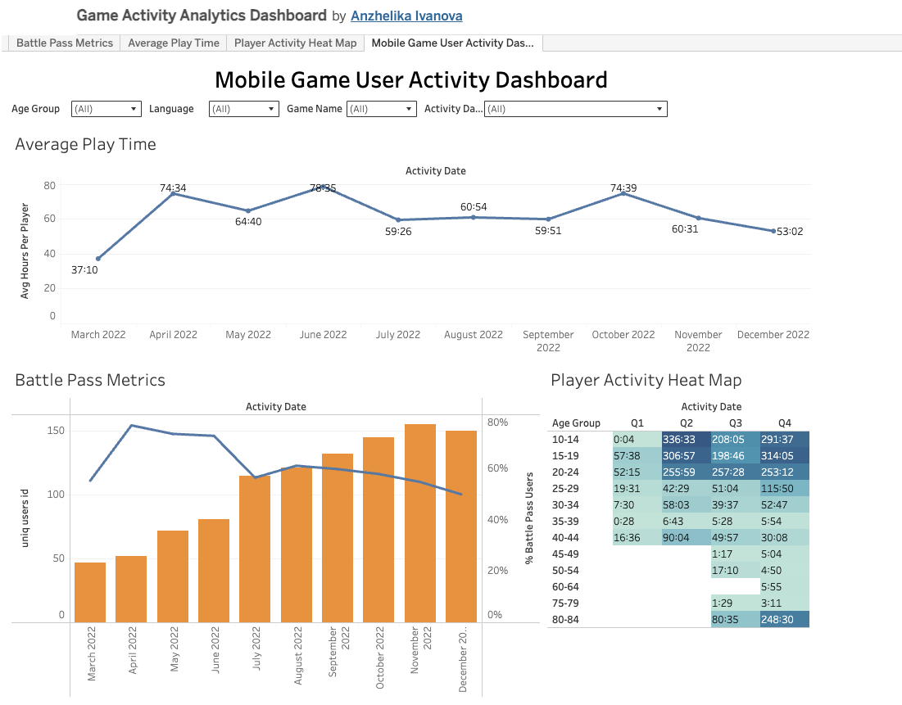

# Mobile Game User Activity Dashboard

## Project Overview

This project was created in Tableau to analyze player engagement and game activity trends.

### Dashboard includes:

* Average Play Time trend
* Battle Pass Metrics (dual-axis chart)
* Player Activity Heat Map
* Interactive filters (Age Group, Language, Activity Date, Game Activity)

## Key Skills Demonstrated

* Tableau Dashboard Design
* Calculated Fields
* Dual-Axis Charts
* Heat Maps
* Interactive Filters
* Data Visualization
* Business Metrics Interpretation

## Tools

* Tableau Public
* CSV Dataset

## Dashboard Preview

  

## Tableau Public Link

[View Interactive Dashboard]([PASTE_YOUR_TABLEAU_PUBLIC_LINK_HERE](https://public.tableau.com/app/profile/anzhelika.ivanova/viz/GameActivityAnalyticsDashboard_17804055010000/MobileGameUserActivityDashboard
)
